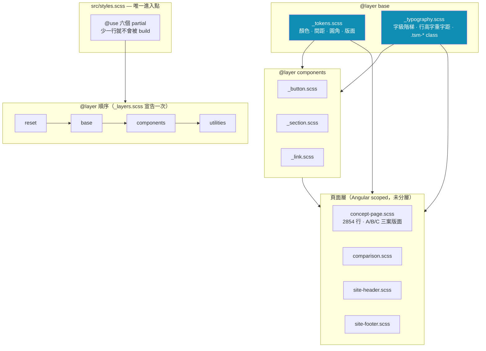
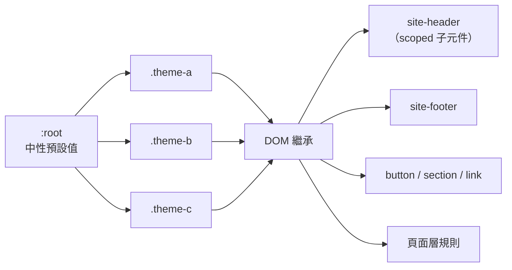
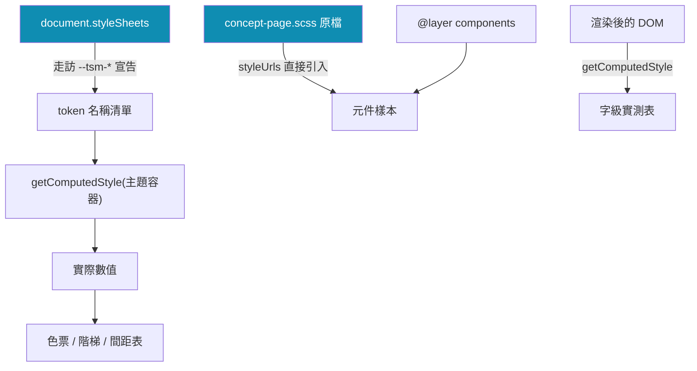
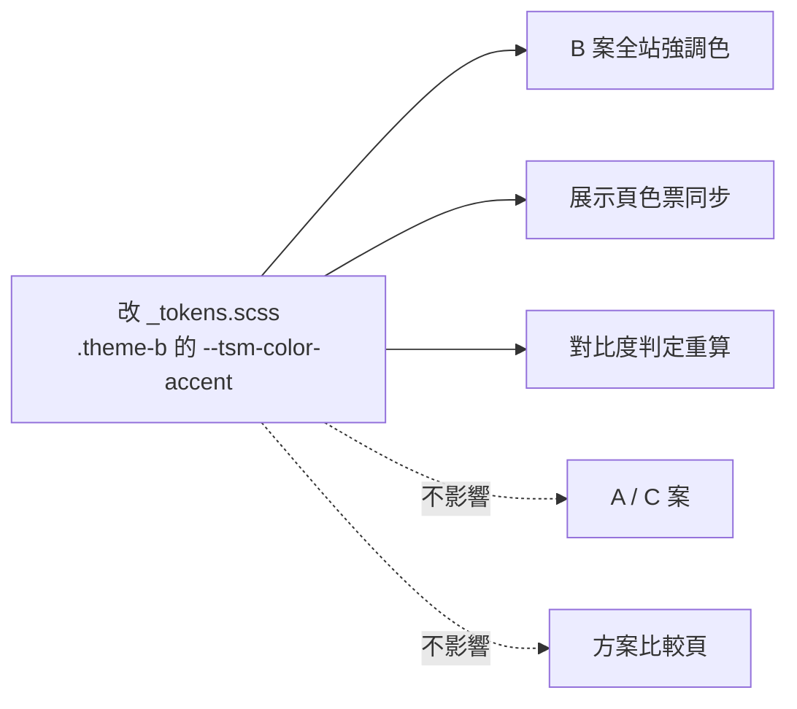

# 架構

這份是 design system 的地圖：東西放在哪、為什麼放在那、改一個值會流到哪裡。

## 全貌

**未分層的樣式勝過所有已分層的樣式。** Angular 元件 SCSS 沒有 `@layer`，
所以頁面層永遠贏過全域 `components` 層——這是頁面覆寫仍然生效的原因，
也是遇到 specificity 問題時該先想 layer、而不是 `!important` 的原因。

## 主題怎麼流下去

token 是 CSS 自訂屬性，會沿 DOM 繼承。主題只要掛在容器上，
**包含使用 emulated encapsulation 的子元件在內**，底下所有東西都取得正確的值。
這是展示頁不需要 `ViewEncapsulation.None` 的原因。

`:root` 只放「未套用主題時」也要能解析的值——方案比較頁 `/` 不在任何主題容器內。

## 展示頁為什麼是鏡子不是副本

三條路都指向同一份程式碼：

1. **token 名稱**由走訪樣式表得到——在 `_tokens.scss` 新增一個 token，
   展示頁自動出現，不必改展示頁一行。
2. **元件樣本**由全域元件層 + 直接引入的 `concept-page.scss` 原檔渲染，
   與內頁由同一份程式碼上色。
3. **數值**全部 `getComputedStyle` 即時讀取，不寫死。

> 實證：Icon 階梯從 11 階收成 4 階時，展示頁自動從 56 階變 49 階，沒有改任何一行。

## 一個值改動後會流到哪

驗收判準（實測過）：把 `.theme-b` 的 `--tsm-color-accent` 改成紅色，
**只有 B 案**產生差異（142,569 px）。這證明 token 層是真的，不是裝飾。

## 守門機制

| 層級 | 工具 | 擋什麼 |
|---|---|---|
| 樣式契約 | `npm run check:styles` | 非 token 的 `font-size`／固定 `gap`；色碼字面值超過棘輪；partial 沒被 `@use` |
| 單元測試 | `npm test -- --watch=false` | 路由、內容模型、元件渲染、展示頁結構 |
| 建置 | `npm run build` | 型別、SCSS 編譯、bundle 預算 |
| 視覺回歸 | **手動**截圖比對 | 三案 × 四斷點，容差 0 |

視覺回歸還沒自動化，流程寫在 [`conventions.md`](conventions.md#驗證視覺回歸)。

## 目前規模

| 項目 | 數字 |
|---|---|
| 顏色 token | 17（× 3 主題） |
| 間距 token | 26 |
| 圓角 token | 3（× 3 主題） |
| 字級階梯 | 48 階 / 7 個角色 |
| 全域元件 | 3（button / section / link） |
| 頁面層 SCSS | 2854 行 |
| 色碼字面值 | 27（棘輪守住） |

## 相關文件

- [`tokens.md`](tokens.md) — 顏色、間距、圓角
- [`typography.md`](typography.md) — 字級階梯與 typography class
- [`components.md`](components.md) — 元件契約
- [`conventions.md`](conventions.md) — `@layer` 判定、反模式、檢查清單
- [`concept-briefs.md`](concept-briefs.md) — 三案的設計意圖（延伸開發用）
- [`production-readiness.md`](production-readiness.md) — 選定一案後還缺什麼
- [`known-issues.md`](known-issues.md) — 技術債
