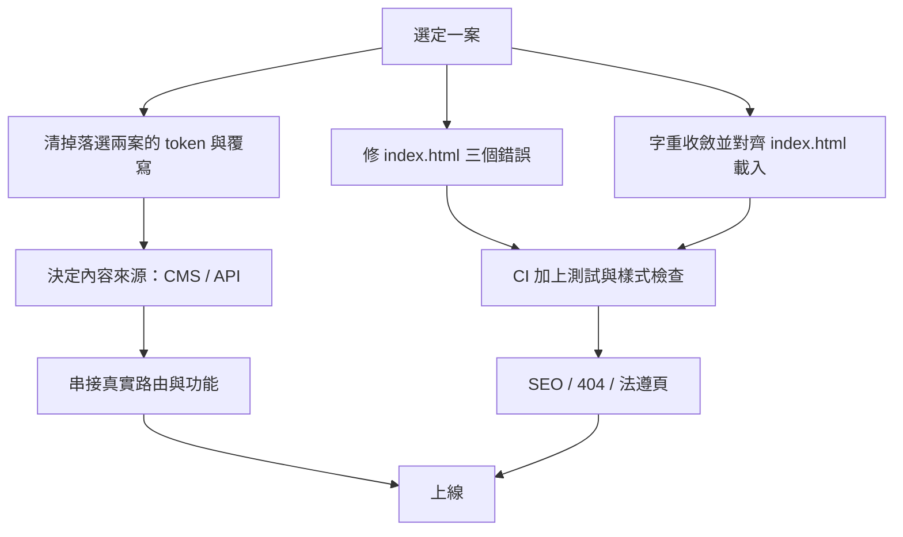

# 選定一案之後還缺什麼

目前這個專案是**提案網站**：三案共用內容、驗證視覺方向。要把其中一案變成學會的正式官網，
以下是還沒做的事，依「不做會出事」到「可以之後再說」排序。

每一項都標了它是**這個 session 發現的事實**，還是**一般性的上線需求**。

---

## 一、會直接影響上線品質（必須做）

### 1. 字重根本沒載入 ⚠️ 本次發現

`src/index.html` 只載入 `wght@400;500;700;900`，但樣式表用了 **9 種字重**：

| 字重 | 使用次數 | 有載入？ |
|---|---|---|
| 600 | 26 | ❌ |
| 700 | 15 | ✅ |
| 900 | 7 | ✅ |
| 750 | 4 | ❌ |
| 500 | 4 | ✅ |
| 650 | 3 | ❌ |
| 300 | 2 | ❌ |
| 620 | 1 | ❌ |
| 200 | 1 | ❌ |

**37 筆宣告的字重沒有對應的字型實例**，瀏覽器會退到最接近的已載入字重、
或用合成加粗。也就是說：**現在看到的畫面，不是 CSS 寫的那個樣子。**

B 案受害最深——它幾乎只用 600（18 處中的 18），而 600 沒有載入。

**要做**：把字重收斂成實際需要的 3–4 種，`index.html` 與 `_typography.scss`
的 `--tsm-font-weight-*` 對齊，並確認 Noto Sans TC 與 Inter 兩套都載入該範圍。
選定一案後只載那一案用到的字重（其他兩案的字重可以一起移除）。

### 2. `index.html` 有三個實質錯誤 ⚠️ 本次發現

```html
<html lang="en">                              <!-- 內容是繁體中文 -->
<title>Website</title>                        <!-- 佔位字串 -->
<meta name="theme-bolor" content="#f5f7f8">   <!-- 拼錯，應為 theme-color -->
<meta name="description" content="台灣微生物學會網站 A／C 設計方案">  <!-- 已過時，現在是三案 -->
```

`lang="en"` 會讓螢幕閱讀器以英文發音讀中文內容，也影響搜尋引擎判斷。
`theme-bolor` 這個 meta 完全不生效。

### 3. CI 不跑測試 ⚠️ 本次發現

`.github/workflows/deploy-pages.yml` 只有 `npm ci` 與 `npm run build`。
測試與樣式契約檢查都沒進 CI——**壞掉的測試不會擋下部署**。

**要做**：在 build 之前加上

```yaml
- run: npm run check:styles
- run: npm test -- --watch=false
```

### 4. 無障礙對比度未達標

| 項目 | 現況 | 影響 |
|---|---|---|
| B 案 `ink-faint` `#6a8ea1` | 對白底 3.50:1 | 用於 meta 與日期，字級偏小，未達一般文字 AA |
| 強調色上的白字 | 3.84:1 | 按鈕字級 ≥16px 且粗體，屬邊界情況 |

以 `/#/design-system` 的色彩區塊逐項檢查，不要目測。

### 5. 導覽與功能全是假的

導覽、會員、繳費、投稿連結目前都是頁內錨點，沒有串接任何後端。
這是提案網站的正常狀態，但選定一案後就是最大的一塊工。

---

## 二、內容要能被非工程師更新（強烈建議）

現在所有文案寫死在 `src/app/core/site-content.ts`，改一個公告要改程式碼、跑 build、部署。

學會的實際需求是**公告、活動、資源會持續更新**。需要決定：

- 接 Headless CMS（Strapi / Contentful / Sanity）
- 或用 Git-based CMS（Decap CMS）——文件仍在 repo，門檻低，適合小團隊
- 或自建後台

`site-content.models.ts` 的介面已經定義好內容形狀，接 API 時可以直接沿用。

同時要處理：`concept-page.ts` 的 `mediaPath()` 與 `newsImage()` 把圖片檔名對照表
寫死在元件裡，接 CMS 時圖片路徑應該由內容提供。

---

## 三、正式網站該有但目前沒有的

| 項目 | 現況 |
|---|---|
| SEO meta / Open Graph | 只有一個過時的 description，沒有 OG、沒有結構化資料 |
| sitemap.xml / robots.txt | 無 |
| 404 頁 | wildcard 路由直接導回首頁，使用者不知道自己走錯 |
| 載入與錯誤狀態 | `<app-content-state>` 元件存在但幾乎沒用上 |
| 表單 | 入會申請、聯絡表單都還不存在（含驗證與送出後狀態） |
| 搜尋 | 學會網站通常需要公告／資源搜尋 |
| 分析 | 無 GA／Plausible 之類 |
| 路由模式 | 目前是 hash 路由（`/#/concept-a`）。正式站建議改 path 路由，需要伺服器端 rewrite 設定 |
| 圖片格式 | A／C 用 `.webp`、B 用 `.png`，體積不一致；也沒有 responsive `srcset` |
| 法遵 | 台灣個資法要求的隱私權政策、Cookie 告知、服務條款都還沒有 |

最後一項若要處理，這個環境有 `web-legal-risk-tw` skill 可以做完整的法律風險盤點。

---

## 四、Design System 本身的待辦

以下不影響上線，但影響**之後改起來痛不痛**。完整清單見 [`known-issues.md`](known-issues.md)。

| 項目 | 說明 |
|---|---|
| 落選兩案的清理 | 選定一案後，另兩案的 token 與覆寫會成為死碼。`_tokens.scss` 中刪掉對應主題區塊即可，這是三主題都完整定義的直接好處 |
| `concept-page.scss` 仍 2854 行 | 頁面層元件（`.quick-item`、`.event-item`、`.news-card`、`.member-action`）尚未升到全域元件層 |
| 標記未改用 `.tsm-*` class | 見下方說明——這件事的做法需要先決定 |
| 9 種斷點 | 520／640／720／767／860／900／1023／1180／1199，沒有共識 |
| 27 個色碼字面值 | 棘輪守住，但頁尾深色系值得一組 inverse surface token |
| 視覺回歸未自動化 | 目前靠手動截圖比對 |

### 關於「標記改用 `.tsm-*` class」

本次量測後發現這件事**不能照原計畫做**。原本的想法是讓 class 綁定字級＋行高＋字重＋字距，
但資料顯示這四項在三案之間根本不成一組：

| 角色 | 行高 | 字重 | 字距 |
|---|---|---|---|
| Headline | 3 種 | 4 種（650／900／600） | 4 種（-0.03／-0.045／-0.055／無） |
| Title | 5 種 | 2 種 | 1 種 |
| Label | 1 種 | 3 種 | **8 種** |

而且**同一個主題內也不一致**：B 案的 label 就用了 0.09／0.04／0.14／0.03em 四種字距。

也就是說字重與字距是**元件層級的表達**，不是角色層級的屬性。強行綁進 class 會改掉
三案各自的排版性格——C 案的 900 字重配 −0.055em 緊縮、B 案的 600 配鬆字距，
正是三案之所以是三案的一部分。

**建議的做法**（尚未執行，待決定）：

1. 由字級階梯產生**每一階一個 class**（`.tsm-headline-lg`、`.tsm-title-sm`…），
   以 SCSS map 一次產出 token 與 class，維持單一真相。
2. class 只帶 **font-size**（必要時加 line-height），weight 與 tracking 留在元件規則。
3. 標記逐區塊遷移，每次遷移做截圖比對。

這樣做的收益是「看標記就知道字級角色」，而不是消滅元件層的排版宣告——後者做不到，
也不該做。

---

## 建議的執行順序



第一批（1–4 項）是**與選案無關、現在就能做**的，而且都很小。
真正的工作量在「決定內容來源」與「串接功能」。
